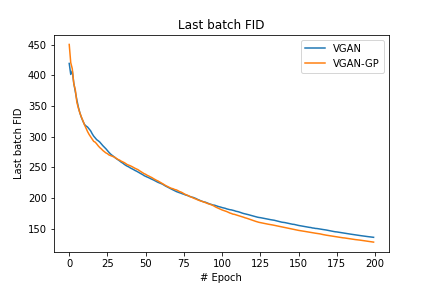

# VGAN
PyTorch(v1.9.0) implementation of [Variational Discriminator Bottleneck: improving Imitation Learning, Inverse RL, and GANs by constraining Information Flow](https://arxiv.org/abs/1810.00821) for [Deep Learning and GANs WASP course '21](https://internal.wasp-sweden.org/graduate-school/wasp-graduate-school-courses/deep-learning-and-gans/).

It has been tested on both RGB and grayscale datatypes through CIFAR-10 and FER-2013 datasets.

## Requirements

* [pytorch 1.9.0](https://pytorch.org/)
* [torchvision 0.8.1](https://pytorch.org/vision/stable/index.html)
* [torchmetrics 0.4.1](https://torchmetrics.readthedocs.io/en/latest/pages/quickstart.html#install) 
* [tqdm 4.54.1](https://github.com/tqdm/tqdm)


## Usage

Run train [``train.py``](https://github.com/tmralmeida/VGAN/blob/main/train.py) with the respective options:

```
python train.py [-h] [--dataset  {CIFAR-10, FER-2013}] 
                [--model {VGAN,VGAN-GP}] [--batch_size BATCH_SIZE]
                [--num_workers NUM_WORKERS] [--epochs EPOCHS]
                [--lr_gen LR_GEN] [--lr_disc LR_DISC]
                [--ic IC] [--beta BETA]           
                [--alpha ALPHA] [--save_dir SAVE_DIR]   
                [--nimgs_save NIMGS_SAVE]                                        
```

For help on the optional arguments run: ``python train.py -h``


### Running: Training

```
python train.py --dataset CIFAR-10 --batch_size 128 --epochs 200
```

### Running: Evaluation

```
python evaluate.py --dataset FER-13 --generator_path logs/FER-13/gen.pth --discriminator_path logs/FER-13/disc.pth
```


## Results

**FER-13 dataset**

<p float="left">
  
  
</p>